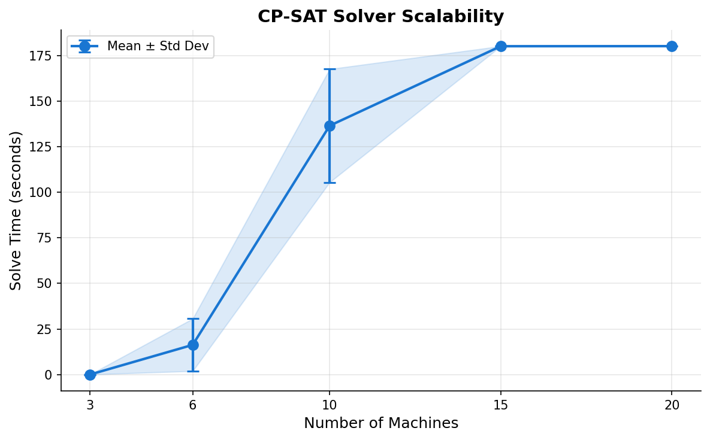
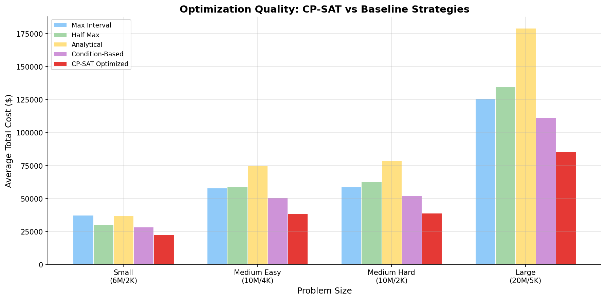
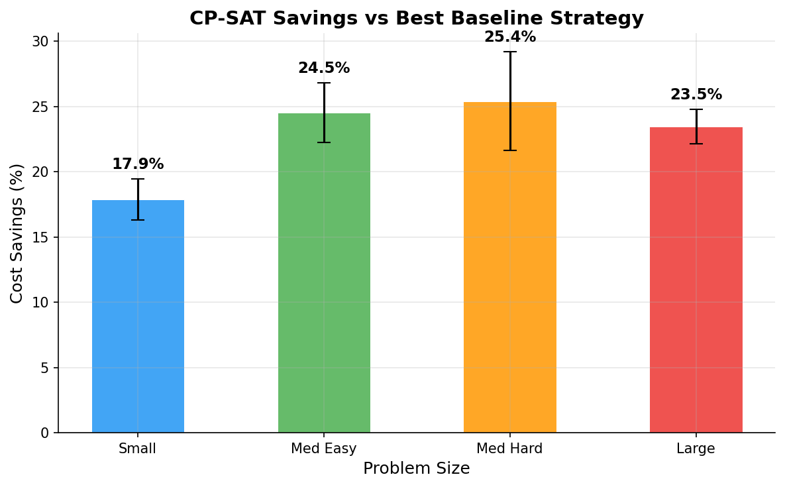
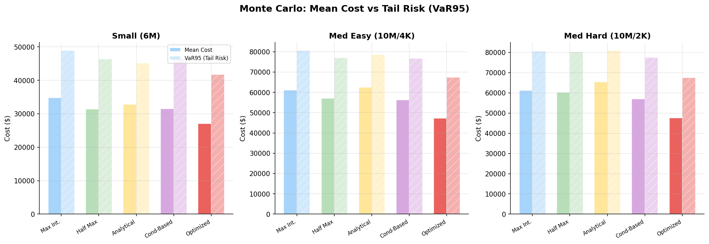

# Experimental Results {#sec-results}

This chapter presents the results of three experiments designed to answer a
straightforward question: does MaintAlign's CP-SAT optimizer actually produce
cheaper maintenance schedules than simpler strategies? Beyond cost savings, the
experiments also test how far the solver scales before it runs out of time, and
whether the savings hold up when machines fail randomly instead of following
neat expected-value calculations.

## Experimental Design

### Research Questions

Three research questions guide the experiments:

1. **Scalability.** How large of a problem can the CP-SAT solver handle within a
   reasonable time limit?
2. **Optimization quality.** Does the optimized schedule cost less than schedules
   produced by common baseline strategies?
3. **Risk robustness.** Do the cost savings survive when machines fail randomly
   according to their Weibull distributions, rather than deterministically?

### Problem Instances

Each experiment uses synthetic factory configurations generated with controlled
random seeds. A problem instance specifies the number of machines, the number of
available technicians, the planning horizon in periods, and the number of
production chains linking machines together. @tbl-instances summarizes the four
standard sizes used across experiments.

| Label | Machines | Technicians | Horizon | Chains | Description |
|:------|:--------:|:-----------:|:-------:|:------:|:------------|
| Small | 6 | 2 | 20 | 1 | Compact factory, one chain |
| Medium Easy | 10 | 4 | 30 | 2 | More machines, generous staffing |
| Medium Hard | 10 | 2 | 30 | 2 | Same machines, half the technicians |
| Large | 20 | 5 | 50 | 4 | Full-scale scenario |

: Problem instance configurations used across experiments. {#tbl-instances}

The difference between Medium Easy and Medium Hard is worth calling out. Both
have the same 10 machines and the same 2 production chains, but Medium Hard only
gets 2 technicians instead of 4. That means the solver cannot schedule as many
machines for maintenance at the same time, which makes the scheduling problem
harder to solve. Including both sizes lets us see how technician constraints
affect the optimizer.

Each machine's Weibull parameters ($\beta$ and $\eta$), maintenance costs, and
production rates are drawn randomly using the seed, so different seeds produce
different factory layouts. Every experiment runs 3 seeds per problem size to
reduce the chance that results depend on one lucky or unlucky configuration.

### Baseline Strategies

To evaluate whether CP-SAT optimization is worth the computational effort, each
optimized schedule is compared against four baseline strategies. These represent
common approaches to maintenance scheduling that a factory might use without an
optimizer:

- **Max Interval** schedules maintenance as late as the system allows. This
  minimizes the number of PM events but accepts higher failure risk.
- **Half Max** sets maintenance at half the maximum allowed interval. It is a
  conservative middle ground that most factories would consider reasonable.
- **Analytical** uses the Weibull closed-form formula to compute the
  theoretically optimal interval for each machine individually. It ignores
  interactions between machines, which is a significant limitation when
  production chains are involved.
- **Condition-Based** triggers maintenance when a machine's expected failure cost
  exceeds the cost of doing PM at that point. This is the most adaptive of the
  four baselines because it responds to each machine's actual degradation
  characteristics.

None of these baselines consider production chain dependencies, technician
capacity limits, or opportunities to group maintenance events together. The
CP-SAT optimizer is the only strategy that accounts for all of these factors
simultaneously.

### Solver Configuration

All experiments use Google OR-Tools CP-SAT with a time limit of 180 seconds per
solve. When the solver finishes within the time limit, it returns a provably
optimal solution (status: OPTIMAL). When it runs out of time, it returns the
best solution it has found so far (status: FEASIBLE). The restoration factor $q$
varies by instance but typically falls between 0.18 and 0.42, meaning each PM
event restores roughly 58--82% of the machine's effective age.

## Evaluation

This section walks through the three experiments and their results. The first
experiment checks whether the solver can handle problems of increasing size. The
second experiment asks whether the solutions it produces are actually cheaper
than simpler alternatives. The third experiment puts those solutions through
randomized failure simulations to see if the cost savings are real or just
artifacts of the deterministic cost model.

### Experiment 1: Solver Scalability

The scalability experiment measures how long CP-SAT takes to find a solution as
the number of machines grows from 3 to 20. Each problem size is run with 3
different seeds, and the solver has a 180-second time limit per run.

{#fig-scalability}

The results in @fig-scalability show a steep growth curve. At 3 machines, the
solver finishes in under a tenth of a second and finds a provably optimal
solution every time. At 6 machines the average time climbs to about 16 seconds,
but all three runs still reach optimality. Things change at 10 machines — the
average jumps to around 136 seconds, and only 2 out of 3 runs prove optimality
before the time limit. At 15 and 20 machines, every run hits the 180-second
ceiling and returns a feasible but not provably optimal solution.

This is not surprising for constraint programming. Each additional machine adds
new decision variables (when to schedule its maintenance) and new constraints
(technician limits, chain dependencies, grouping opportunities), so the search
space grows combinatorially. What matters for practical purposes is that even
when the solver times out, it still returns a usable schedule. It just cannot
guarantee that no cheaper schedule exists. The next experiment shows that these
timed-out solutions still beat all four baselines, which suggests the solver is
doing useful work even when it cannot finish.

### Experiment 2: Baseline Comparison

This experiment compares the total maintenance cost of CP-SAT optimized
schedules against the four baselines described above. Total cost is the sum of
four components: preventive maintenance costs, expected failure costs, production
losses from downtime, and retooling costs when machines in the same production
chain go down.

{#fig-baselines}

@fig-baselines shows the average total cost for each strategy at each problem
size. The red bars (CP-SAT Optimized) are the shortest at every size, meaning
the optimizer consistently finds the cheapest schedules. The gap between the
optimizer and the baselines also gets wider as problems get bigger. This makes
sense — larger problems have more machines in production chains and more
opportunities for grouping maintenance events, which are exactly the things the
optimizer exploits that the baselines cannot.

One thing that stands out is that condition-based scheduling is the strongest
baseline at every problem size. It beats max interval, half max, and even the
analytical strategy because it adapts to each machine's failure characteristics
rather than using a fixed rule. But even against condition-based, the optimizer
produces meaningful savings.

{#fig-savings}

@fig-savings puts actual percentages on the improvement. For the small instance
(6 machines), the optimizer saves about 17.9% over the best baseline. For the
medium and large instances, savings climb to between 23.5% and 25.4%. To put
that in concrete terms: on the large instance (20 machines), the optimizer
averages a total cost of \$85,413 versus \$111,520 for the best baseline — a
difference of roughly \$26,100 per planning horizon.

It is worth looking at where those savings actually come from. @tbl-breakdown
splits the cost into its four components for three strategies on the large
instance.

| Component | Max Interval | Condition-Based | CP-SAT Optimized |
|:----------|:-----------:|:---------------:|:----------------:|
| PM Cost | \$9,540 | \$14,778 | \$16,930 |
| Failure Cost | \$80,419 | \$55,182 | \$42,542 |
| Production Loss | \$23,345 | \$28,068 | \$32,335 |
| Retooling Cost | \$12,182 | \$13,491 | \$15,494 |
| **Total** | **\$125,485** | **\$111,520** | **\$85,413** |

: Cost breakdown for the large instance (20 machines), averaged across 3 seeds. {#tbl-breakdown}

The pattern here is interesting. The optimizer actually spends *more* on
preventive maintenance (\$16,930 versus \$14,778 for condition-based) and has
higher production losses (\$32,335 versus \$28,068). But those extra costs are
more than offset by a massive reduction in failure costs: \$42,542 for the
optimizer versus \$55,182 for condition-based versus \$80,419 for max interval.
The optimizer's strategy is basically to spend a little more on planned
maintenance upfront to avoid much larger costs from unplanned breakdowns later.

The higher production loss also makes sense when you think about it. More
frequent planned maintenance means more scheduled downtime. But each planned
event is shorter and cheaper than a surprise failure that could shut down an
entire production chain and trigger retooling across multiple machines.

### Experiment 3: Monte Carlo Risk Analysis

The previous two experiments compute costs deterministically — they multiply
failure probabilities by failure costs to get expected values. That is
mathematically clean but does not reflect what actually happens in a factory.
In reality, a machine either fails or it does not, and some months you get
unlucky with several failures hitting at once.

Monte Carlo simulation addresses this by running hundreds of randomized
scenarios. For each maintenance schedule, the system runs 500 simulations where
every machine either fails or survives each period based on random draws from
its Weibull distribution. Instead of computing expected failure costs
mathematically, the simulation counts actual failures, tracks actual downtime,
and adds up actual costs. Running 500 trials gives a distribution of possible
outcomes rather than a single number.

{#fig-montecarlo}

@fig-montecarlo shows two things for each strategy: the average cost across all
500 simulations (solid bars) and the VaR95 (hatched bars). VaR95 stands for
Value at Risk at the 95th percentile — in plain terms, it is the cost you would
expect to hit or exceed in the worst 5% of scenarios. It captures tail risk, or
how bad things can get when you are unlucky.

The optimized schedules come out ahead on both measures. On the small instance,
the optimizer averages \$27,044 across simulations compared to \$31,522 for
condition-based — a 14.2% reduction. On the medium-hard instance, it is
\$47,608 versus \$56,978, which is a 16.4% reduction.

@tbl-montecarlo gives the full picture including failure counts and downtime
numbers.

| Size | Strategy | Mean Cost | VaR95 | Avg Failures | Avg Downtime |
|:-----|:---------|:---------:|:-----:|:------------:|:------------:|
| Small | Max Interval | \$34,857 | \$48,905 | 7.4 | 21.4 days |
| Small | Condition-Based | \$31,522 | \$46,618 | 5.5 | 16.3 days |
| Small | **CP-SAT Optimized** | **\$27,044** | **\$41,686** | **3.8** | **10.8 days** |
| Med Easy | Max Interval | \$61,119 | \$80,595 | 12.0 | 39.3 days |
| Med Easy | Condition-Based | \$56,285 | \$76,663 | 9.2 | 30.5 days |
| Med Easy | **CP-SAT Optimized** | **\$47,180** | **\$67,287** | **6.5** | **21.0 days** |
| Med Hard | Max Interval | \$61,155 | \$80,663 | 12.0 | 39.4 days |
| Med Hard | Condition-Based | \$56,978 | \$77,483 | 9.7 | 32.3 days |
| Med Hard | **CP-SAT Optimized** | **\$47,608** | **\$67,496** | **6.8** | **22.1 days** |

: Monte Carlo simulation results averaged across seeds (500 simulations each). Only three strategies shown for readability. {#tbl-montecarlo}

The downtime numbers are probably the most practically meaningful result in the
whole chapter. On the medium-hard instance, the optimized schedule averages 22.1
days of total downtime over the planning horizon, versus 32.3 days for
condition-based and 39.4 days for max interval. That is roughly 10 fewer days
where machines are sitting idle compared to condition-based scheduling, and 17
fewer days compared to max interval. In a real factory, those extra days of
uptime translate directly into production output.

The VaR95 results also deserve attention. For the medium-easy instance, the
optimized schedule's worst-case cost (at the 95th percentile) is about \$67,287
compared to \$76,663 for condition-based. So the optimizer does not just cut
average costs — it also reduces the risk of really bad outcomes when machines
fail in unlucky patterns.

One observation that applies to all strategies: the Monte Carlo costs are
generally higher than the deterministic calculations from Experiment 2. This
happens because the deterministic model uses expected values, which smooth out
the impact of scenarios where several machines fail close together. The
simulation captures those cascading failures, which drives costs up for every
strategy. The fact that the optimizer maintains its advantage even when these
bad scenarios are included is reassuring.

## Threats to Validity

No experiment is perfect, and there are several factors that could affect how
much these results generalize.

**Synthetic data.** All experiments use randomly generated factory
configurations rather than real industrial data. Real factories have correlated
failures (for example, machines sharing a power supply might both go down in a
surge), seasonal demand patterns, and degradation profiles more complex than a
two-parameter Weibull model. MaintAlign works well on the kinds of problems it
was designed for, but a real-world deployment would need validation against
actual maintenance logs.

**Time limit effects.** For 15 or more machines, the solver hits the 180-second
limit and returns a feasible but not provably optimal solution. That means the
reported savings at larger sizes are a lower bound — the solver might have found
something even better with more time. On the flip side, 180 seconds was chosen
somewhat arbitrarily. A user in a hurry might want results in 30 seconds and
accept a slightly worse schedule, while someone planning quarterly maintenance
might be happy to let the solver run for 10 minutes.

**Limited random seeds.** Three seeds per problem size (and two for Monte Carlo)
is enough to show consistent trends, but it is not enough for strong
statistical claims like confidence intervals. A more rigorous evaluation would
use 30 or more seeds and report means with error bars at every comparison point.

**Baseline fairness.** The four baseline strategies are all relatively simple
rules. A more sophisticated comparison would pit the optimizer against something
like a genetic algorithm or a greedy heuristic that also considers grouping
opportunities. The current results show that CP-SAT beats straightforward
scheduling rules. They do not show that it beats every possible alternative
approach.

**Simulation assumptions.** The Monte Carlo simulations draw failures from the
exact same Weibull distributions that were used to build the schedule. In
practice, those distributions are estimated from historical data and could be
wrong. If the real failure behavior differs significantly from the assumed
Weibull parameters, the optimizer's advantage might shrink or grow — there is no
way to know without testing on real data.

## Summary

Across all three experiments, the results are consistent. The CP-SAT optimizer
produces schedules that cost 18--25% less than the best baseline strategy, and
those savings hold up under Monte Carlo simulation with random failures. The
main trade-off is scalability: the solver finds provably optimal solutions for
up to about 6 machines but hits the time limit at 15 or more. Even so, the
timed-out feasible solutions still outperform every baseline tested. The Monte
Carlo results confirm that the optimizer's advantage is not just a mathematical
artifact — it translates to fewer failures, less downtime, and lower costs when
machines actually break down randomly.
