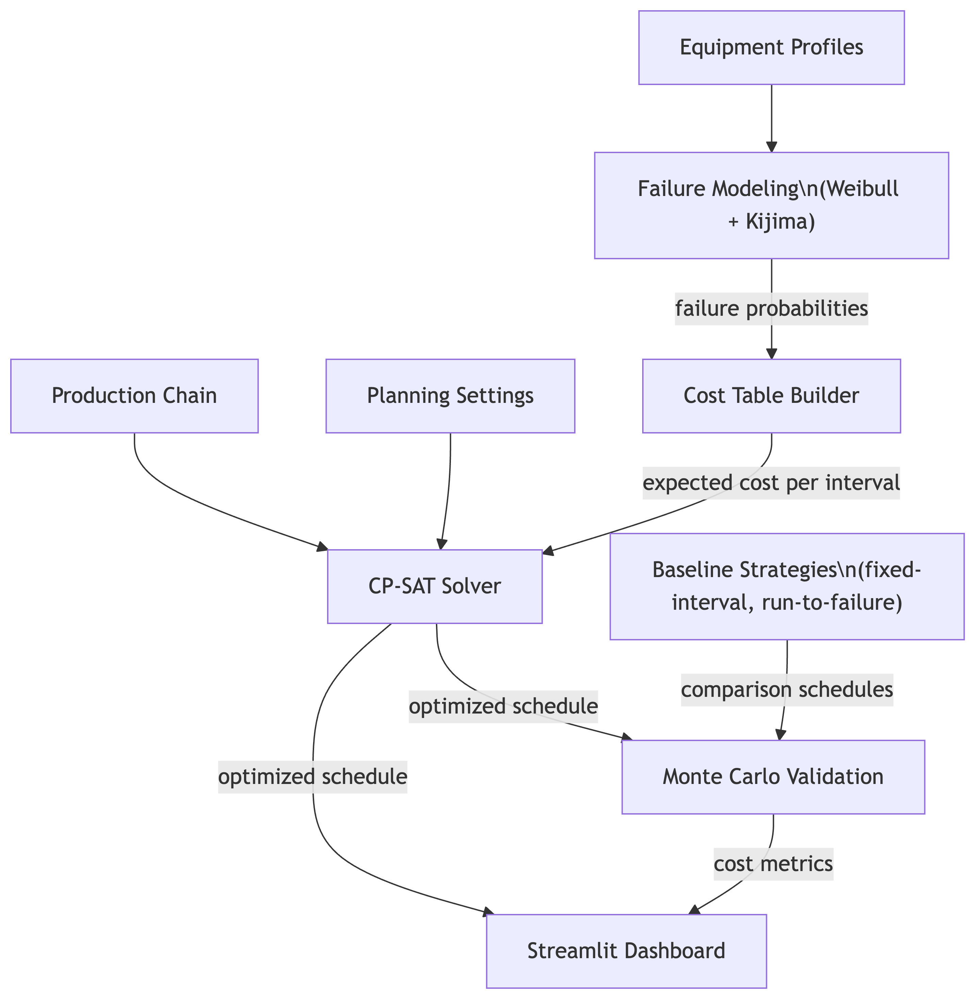
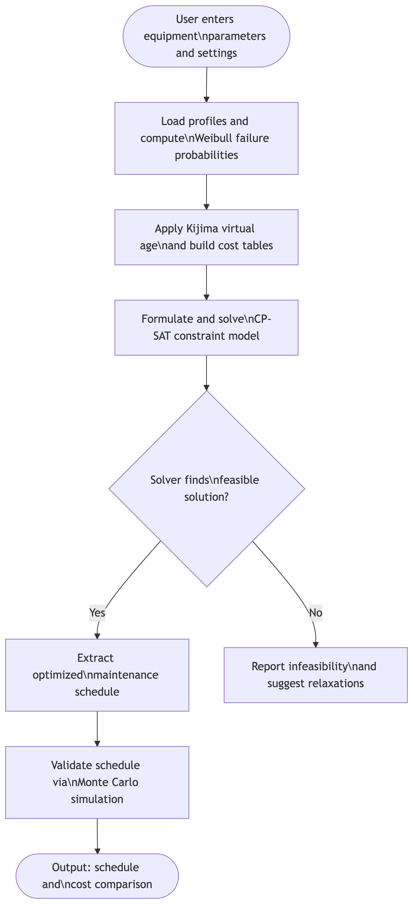

# Methodology {#sec-methodology}

This chapter explains how MaintAlign works, what it is built with, and how it is tested. The goal is to provide enough detail that a reader could understand the system's logic, evaluate its design decisions, and potentially reproduce the experiments. The chapter begins with a high-level overview of the system architecture, then walks through the technology stack, failure modeling, constraint formulation, and experimental design. The complete source code for MaintAlign is publicly available on GitHub at <https://github.com/Jsharsh33v/MaintAlign.git>.

## System Overview {#sec-system-overview}

MaintAlign is a preventive maintenance scheduling optimizer. It takes in a set of industrial equipment profiles, each with their own failure characteristics and cost parameters, along with a description of how those machines are connected in production chains. It then uses constraint programming to find the cheapest possible maintenance schedule, and validates that schedule by simulating thousands of random failure scenarios.

At its core, the system has four layers. The input layer collects equipment parameters, production chain dependencies, and planning settings from the user. The core engine uses those inputs to model failure probabilities, compute expected costs, and run the CP-SAT constraint solver to find an optimal schedule. The validation layer tests the resulting schedule against baseline strategies using Monte Carlo simulation. The output layer presents the optimized schedule and cost comparison through a Streamlit dashboard. @fig-architecture shows how data flows between these layers.

{#fig-architecture width=80%}

This separation means each component is testable on its own. The failure modeling layer produces cost tables without touching the solver. The solver finds the cheapest schedule without running simulations. If a component needs to be swapped — for example, replacing CP-SAT with a different solver — the rest of the system stays the same.

## Development Environment and Technology Stack {#sec-tech-stack}

MaintAlign is written entirely in Python 3.11, chosen for its strong library support in both scientific computing and constraint programming.

The constraint solver is Google OR-Tools CP-SAT [@GoogleORTools], a constraint programming library developed by Google Research. CP-SAT is designed for combinatorial optimization problems — exactly the kind of problem that maintenance scheduling represents. It was chosen over alternatives like Gurobi or CPLEX because it is open-source, well-documented and handles the integer decision variables that MaintAlign uses to represent discrete maintenance intervals.

Failure probability calculations use NumPy and SciPy [@SciPy2020]. Specifically, `scipy.stats.weibull_min` provides the Weibull cumulative distribution function, and NumPy handles array operations for building cost tables across all equipment units. The Streamlit framework provides the interactive dashboard where users configure equipment, run the optimizer, and view results.

## Failure Modeling and Cost Computation {#sec-failure-modeling}

Before the solver can optimize anything, MaintAlign needs to know how likely each machine is to fail at any given time, and how much that failure would cost. Two mathematical models make this possible: Weibull failure distributions for predicting breakdowns, and the Kijima Type I virtual age model for handling the fact that maintenance does not make a machine perfectly new again.

### Weibull Failure Distributions {#sec-weibull}

The Weibull distribution [@Weibull1951] is a standard tool in reliability engineering for modeling how long a piece of equipment will last before it fails. It is defined by two parameters: the shape parameter $\beta$ and the scale parameter $\eta$. The cumulative distribution function gives the probability that a machine fails before time $t$:

$$
F(t) = 1 - e^{-(t/\eta)^\beta}
$$ {#eq-weibull-cdf}

The shape parameter $\beta$ controls whether failures become more or less likely as the machine ages. When $\beta > 1$, the machine experiences wear-out — it becomes more likely to fail the longer it runs without maintenance. When $\beta < 1$, failures are more likely early in life (infant mortality). When $\beta = 1$, the failure rate is constant and the Weibull reduces to the exponential distribution. Most industrial equipment has $\beta > 1$ because mechanical components wear down over time. The scale parameter $\eta$ is the characteristic life — roughly, the age by which about 63.2% of identical machines would have failed.

To make this concrete, consider a hydraulic press with $\beta = 2.0$ and $\eta = 500$ hours. At 250 hours of operation, the probability of failure is $F(250) = 1 - e^{-(250/500)^{2.0}} = 1 - e^{-0.25} \approx 0.221$, or about 22%. At 400 hours, it jumps to $F(400) = 1 - e^{-(400/500)^{2.0}} = 1 - e^{-0.64} \approx 0.473$, nearly 47%. The failure risk accelerates as the machine ages because $\beta > 1$. This accelerating risk is exactly why preventive maintenance matters — waiting too long pushes the machine into a zone where failure is almost certain.

### Kijima Type I Virtual Age {#sec-kijima}

In the real world, maintenance does not reset a machine to brand-new condition. A repair might replace worn bearings but leave the gearbox, housing, and electrical systems at their current age. The Kijima Type I model [@Kijima1989] captures this by tracking a "virtual age" for each machine that only partially resets after maintenance. After each maintenance action, the new virtual age is:

$$
v_{\text{new}} = q \cdot v_{\text{old}} + t_{\text{since last}}
$$ {#eq-kijima}

Here, $q$ is the maintenance quality factor (a value between 0 and 1), $v_{\text{old}}$ is the virtual age before maintenance, and $t_{\text{since last}}$ is the time elapsed since the last maintenance. When $q = 0$, maintenance is perfect — the machine's virtual age resets to zero as if it were brand new. When $q = 1$, maintenance does nothing to reduce wear — the machine continues aging as though no service occurred. Realistic maintenance falls somewhere in between.

For example, consider a conveyor motor with $q = 0.3$. If the motor has a virtual age of 800 hours when maintenance is performed after running for 200 additional hours, the new virtual age is $v_{\text{new}} = 0.3 \times 800 + 200 = 440$ hours. The motor is "younger" than before maintenance (440 vs. 800 hours of effective wear) but not new. This virtual age gets plugged back into the Weibull CDF from @eq-weibull-cdf when computing the failure probability for the next interval, so each round of imperfect maintenance shifts the machine's position on the failure curve rather than resetting it to the origin.

### Cost Table Precomputation {#sec-cost-tables}

MaintAlign combines the Weibull model and Kijima virtual age to precompute a cost table for each piece of equipment before the solver runs. For every possible maintenance interval (measured in discrete time periods), the system calculates the expected cost by weighing two scenarios: the cost of performing preventive maintenance at that interval versus the expected cost of a failure occurring before the scheduled maintenance. The expected cost for interval $\tau$ is:

$$
E[\text{Cost}(\tau)] = C_p \cdot (1 - F(\tau)) + C_f \cdot F(\tau)
$$ {#eq-expected-cost}

Here, $C_p$ is the preventive maintenance cost, $C_f$ is the corrective (failure) maintenance cost, and $F(\tau)$ is the Weibull failure probability at interval $\tau$ given the machine's current virtual age. Because $C_f$ is typically several times larger than $C_p$, the expected cost curve has a sweet spot — an interval where performing maintenance is most cost-effective. Schedule too early and you waste useful life; schedule too late and the high probability of failure drives up the expected cost.

These cost tables are the bridge between the statistical failure models and the constraint solver. The solver does not need to understand Weibull distributions or virtual age — it just sees a lookup table that says "maintaining machine X at interval Y costs Z dollars in expectation." This separation keeps the solver focused on what it does best: finding the globally cheapest combination of intervals across all machines while respecting constraints.

## Constraint Formulation and Optimization {#sec-constraint-formulation}

Once the cost tables are built, MaintAlign formulates a constraint programming model and hands it to the CP-SAT solver. This section explains what the solver is actually optimizing: the decision variables it controls, the constraints it must respect, and the objective it tries to minimize. @tbl-cpsat-formulation summarizes the formulation.

| Component | Description |
|:----------|:------------|
| **Decision Variables** | For each equipment unit $i$, an integer variable $\tau_i$ representing the maintenance interval (in discrete time periods). The solver chooses the value of each $\tau_i$. |
| **Constraint: Planning Horizon** | Every maintenance interval must fall within the planning horizon: $1 \leq \tau_i \leq T$ for all equipment $i$, where $T$ is the total number of time periods. |
| **Constraint: Production Dependencies** | If machine $j$ depends on machine $i$ (i.e., $i$ is upstream of $j$), then $j$ cannot be scheduled for maintenance during a period when $i$ is expected to be running and feeding it work. |
| **Constraint: Downtime Windows** | Maintenance can only be scheduled during allowed downtime windows — periods when the production line can tolerate a machine being offline. |
| **Objective: Minimize Total Cost** | Minimize $\sum_{i} E[\text{Cost}_i(\tau_i)] - \text{GroupingSavings}$, where the grouping savings reward scheduling nearby machines together to share setup costs. |

: CP-SAT constraint model formulation for MaintAlign. {#tbl-cpsat-formulation}

The opportunistic grouping component deserves extra explanation because it is one of MaintAlign's distinguishing features. In practice, taking a machine offline for maintenance incurs a fixed setup cost — shutting down the line, bringing in technicians, staging tools. If two machines that are close together in the production chain are both due for maintenance around the same time, it is cheaper to service them together in one downtime window than to shut down twice. MaintAlign encodes this by adding bonus terms to the objective function whenever the solver schedules nearby machines within the same time window. The solver then naturally gravitates toward grouped schedules because they reduce total cost.

@fig-runtime shows the complete sequence of steps from user input through optimization to validated output.

{#fig-architecture width=80%}

If the solver cannot find a feasible solution — for example, if the downtime windows are too narrow to accommodate all required maintenance — MaintAlign reports the infeasibility and suggests which constraints might need to be relaxed. This prevents the system from silently producing a bad schedule.

## Experimental Design and Evaluation {#sec-experimental-design}

MaintAlign's optimization claims need empirical backing. A solver might find a mathematically optimal schedule, but that optimality is based on the model's assumptions about failure distributions and costs. The real question is whether the optimized schedule actually performs better than simpler strategies when failures happen randomly, as they do in practice. Monte Carlo simulation answers this question.

### Monte Carlo Simulation Setup {#sec-monte-carlo}

The validation pipeline works as follows. For each trial, the simulator generates random failure times for every machine by sampling from that machine's Weibull distribution (using the same $\beta$ and $\eta$ parameters that were used during optimization). It then plays out three different maintenance strategies against those random failures:

1. **MaintAlign's optimized schedule**: maintenance happens at the intervals the solver chose.
2. **Fixed-interval baseline**: every machine is serviced at a uniform interval (for example, every 100 hours), regardless of its failure characteristics.
3. **Run-to-failure baseline**: no preventive maintenance at all — machines are only repaired after they break.

For each strategy, the simulator tracks the total cost: preventive maintenance costs for scheduled services, plus corrective maintenance costs for any failures that occur before the next scheduled service. After running 1,000 or more trials, the simulator computes the mean total cost, standard deviation, and percentage savings of the optimized schedule relative to each baseline.

### Evaluation Metrics {#sec-metrics}

The primary evaluation metric is **mean total expected cost** across all Monte Carlo trials. This represents the average amount a facility would spend on maintenance under each strategy when failures are random. The secondary metrics are:

- **Standard deviation of total cost**: measures how much the cost varies from trial to trial. A lower standard deviation means the strategy delivers more predictable costs, which matters for budgeting.
- **Percentage cost savings**: calculated as $\frac{\text{Baseline Cost} - \text{Optimized Cost}}{\text{Baseline Cost}} \times 100\%$. This gives a single number summarizing how much better the optimized schedule performs compared to each baseline.
- **Grouping utilization rate**: the fraction of opportunistic grouping opportunities that the solver actually exploited, indicating how effectively the system takes advantage of shared downtime windows.

### Input and Output Examples {#sec-io-examples}

To illustrate what MaintAlign actually produces, consider a small example with three machines in a linear production chain (Machine A feeds Machine B, which feeds Machine C) over a 30-day planning horizon.

**Sample input configuration:**

+--------------------------+--------------+--------------+--------------+
| Parameter                | Machine A    | Machine B    | Machine C    |
+==========================+:============:+:============:+:============:+
| Weibull shape ($\beta$)  | 2.0          | 1.5          | 2.5          |
+--------------------------+--------------+--------------+--------------+
| Weibull scale ($\eta$,   | 20           | 25           | 15           |
| days)                    |              |              |              |
+--------------------------+--------------+--------------+--------------+
| Preventive cost ($C_p$)  | \$500        | \$300        | \$700        |
+--------------------------+--------------+--------------+--------------+
| Corrective cost ($C_f$)  | \$3,000      | \$1,800      | \$4,200      |
+--------------------------+--------------+--------------+--------------+
| Kijima quality ($q$)     | 0.3          | 0.4          | 0.2          |
+--------------------------+--------------+--------------+--------------+

: Sample three-machine input configuration. {#tbl-sample-input}

**Sample output (optimized schedule):**

+--------------+------------------------------+------------------+
| Machine      | Scheduled Maintenance (Day)  | Expected Cost    |
+==============+:============================:+:================:+
| Machine A    | Day 12                       | \$743            |
+--------------+------------------------------+------------------+
| Machine B    | Day 12 (grouped with A)      | \$412            |
+--------------+------------------------------+------------------+
| Machine C    | Day 8                        | \$891            |
+--------------+------------------------------+------------------+

: Optimized schedule output for the sample configuration. Machines A and B are grouped on Day 12 to share setup costs. {#tbl-sample-output}

In this example, the solver grouped Machines A and B on Day 12 because they are adjacent in the production chain and their cost-optimal intervals were close enough to make grouping worthwhile. Machine C, with its steeper Weibull curve ($\beta = 2.5$), wears out faster and gets scheduled earlier on Day 8. The Monte Carlo validation then tests this schedule against the two baselines across 1,000+ random failure scenarios to confirm that the savings hold up under uncertainty.

## Summary {#sec-method-summary}

This chapter described MaintAlign's methodology across five areas. The system architecture separates input handling, failure modeling, constraint optimization, and validation into independent layers so that each component can be tested and modified without affecting the others. The technology stack centers on Python 3.11 with Google OR-Tools CP-SAT for constraint solving, SciPy for Weibull failure computations, and Streamlit for the user-facing dashboard. Failure modeling uses Weibull distributions to predict equipment breakdowns and the Kijima Type I virtual age model to account for the reality that maintenance only partially restores a machine, with both models feeding into precomputed cost tables that give the solver a clear picture of expected costs at every possible maintenance interval. The constraint formulation encodes decision variables, planning horizon bounds, production chain dependencies, downtime windows, and opportunistic grouping incentives into a single optimization model that CP-SAT solves for minimum total cost. Finally, the experimental design validates optimized schedules through Monte Carlo simulation across 1,000+ stochastic failure trials, comparing performance against fixed-interval and run-to-failure baselines using mean cost, standard deviation, percentage savings, and grouping utilization as evaluation metrics. The next chapter presents the results of these experiments and discusses what they reveal about the effectiveness of constraint-programming-based maintenance scheduling.
